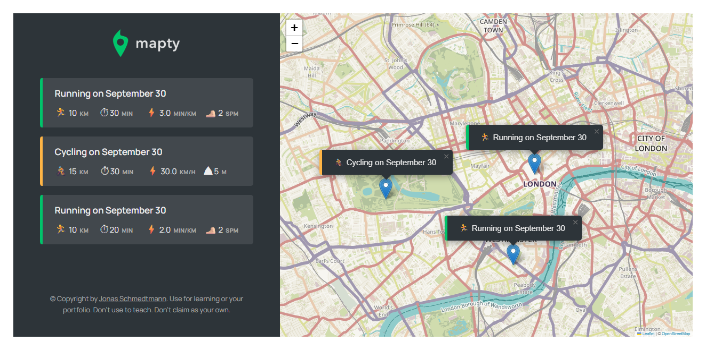

# Mapty Web App

A code along project from Jonas Schmedtmann's
[The Complete JavaScript Course 2025: From Zero to Expert!](https://www.udemy.com/course/the-complete-javascript-course/) course on udemy.

## Table of contents

- [Overview](#overview)
  - [The challenge](#the-challenge)
  - [Screenshot](#screenshot)
  - [Links](#links)
- [My process](#my-process)
  - [Built with](#built-with)
  - [What I learned](#what-i-learned)
  - [Continued development](#continued-development)
- [Author](#author)
- [Acknowledgments](#acknowledgments)

## Overview

### Screenshot

### Links

- Solution URL: [Add solution URL here](https://your-solution-url.com)
- Live Site URL: [Add live site URL here](https://your-live-site-url.com)

## My process

### Built with

- Semantic HTML5 markup
- CSS custom properties
- Flexbox
- CSS Grid
- Leaflet
- Openstreetmap

### What I learned

I've revisited this project because I'd like to have a refresher on how to write OOP in JavaScript.

### Continued development

I'm planning to do the final considerations that Jonas have point out from his course. Those considerations feels like a hard challenge but I like to come out of my comfort zone specially when it comes to challenges and see how far I can go.

## Author

- Github - [SoftPillow20](https://github.com/SoftPillow20)

## Acknowledgments

I would like to thank Mr. Jonas Schmedtmann for teaching me the core fundamentals of JavaScript. I've learnt a lot from his course not only how to write a code in JavaScript but also how to write an effective program for both users and developers.
